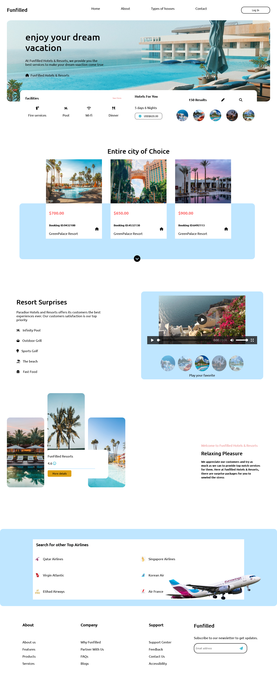
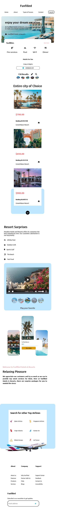

# Funfilled
 A landing page for a fictional brand

This landing page was built using HTML and CSS. For the Layout a combination of both CSS Grid and Flexbox was used. It provides a good opportunity to practice and master some CSS concepts.

Original Figma design was made by @AuntyShelle on twitter. 

The Landing page was made responsive across different screen sizes through the use of Media Queries. 

- Live Site URL: [Click here](https://kb-jr.github.io/Funfilled/)

